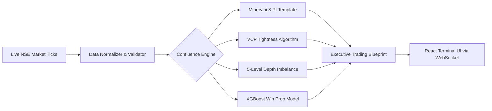

<div align="center">

# 🦅 MarketEye
### *Autonomous Institutional Stock Market Scanner & Swing Trading Intelligence Platform*

[](https://samarth-27.github.io/stock_buyer/)
[-10b981?style=for-the-badge&logo=vitest&logoColor=white)](https://github.com/Samarth-27/stock_buyer)
[](https://www.typescriptlang.org/)
[](https://react.dev/)
[](https://xgboost.readthedocs.io/)
[](https://www.nseindia.com)
[](docs/RENDER_DEPLOYMENT_GUIDE.md)
[](LICENSE)

<br/>

**MarketEye** is India's first real-time institutional stock scanner and quantitative swing-trading decision platform.  
Powered by **Level-2 Order Book Imbalance**, an **XGBoost ML Engine trained on 5-Year Historical NSE Equities**, **Mark Minervini's 8-Point Trend Template**, **Volatility Contraction Patterns (VCP)**, and **Half-Kelly Capital Allocation**.

[Explore Features](#-core-capabilities) • [Quant Architecture](#-system-architecture) • [ML & Strategies](#-quant-strategies--ml-pipeline) • [Brokers](#-broker-integrations) • [Quick Start](#-quick-start-in-60-seconds) • [Documentation](#-documentation-suite)

---

</div>

## 🌟 Executive Summary

Traditional scanners look only at lagging candlestick closes. **MarketEye** inspects what moves the market before price follows:
1. **Live Limit Order Imbalance (TBQ vs TSQ)** across full market depth.
2. **5-Level Microprice Pressure & Spoof Detection** to filter out retail trap volume.
3. **Multi-Day Swing Confluence Engine**: Unifies Minervini Stage 2 rules, VCP tightness, ML statistical probabilities, and Kristjan Qullamaggie 10/20 EMA trailing exits.
4. **Calculated Half-Kelly Sizing**: Tells you *how much capital to risk* per trade based on mathematical statistical edge.

---

## ⚡ Core Capabilities



### 🎯 1. 3-Step Systematic Swing Trading Playbook
* **Step 1: Pick Confluence Setup** — Screen for **Grade A+ Sniper** or **Minervini Stage 2** setups with verified institutional sponsorship.
* **Step 2: Check Entry & Kelly Size** — Lock in entry zones with systematic **Half-Kelly Capital Allocation** (e.g. 15% – 20% portfolio size) and risk scaling based on 20-Day Average Daily Range (ADR).
* **Step 3: Execute Clear Exits** — Book 50% at **Target 1 (+8.5%)**, move stop to breakeven, and let the remaining runner ride to **Target 2 (+15%)** trailing the Daily 10/20 EMA.

### 🧠 2. XGBoost ML Win-Rate Engine
* Trained on **29,520 real historical daily records** across liquid NIFTY 50 securities.
* Calibrated feature importance:
  - **9.5% weight**: ATR Volatility Scaling (Dynamic Stop/Target distance)
  - **7.7% weight**: 20 EMA Momentum Slope & Extension
  - **7.3% weight**: 200 EMA Macro Regime Alignment
  - **6.6% weight**: RSI-14 Institutional Momentum Zone (50–68)
* Evaluates cross-validated statistical edge before generating any execution plan.

### 📐 3. Battle-Tested Swing Strategies
| Strategy | Method / Formula | Key Parameter Checked |
| :--- | :--- | :--- |
| **Mark Minervini Trend Template** | 8-Point Stage 2 Checklist | Price > 50, 150, 200 SMA; 200 SMA rising; >30% off 52W low; within 25% of 52W high |
| **Volatility Contraction Pattern (VCP)** | Multi-stage depth compression | Contractions (e.g., 8% → 4% → 1.8%), tightness score ≥ 85%, volume dry-up at pivot |
| **Qullamaggie Trailing Model** | Exponential Moving Average trail | Breakeven move at T1; exit runners on daily close below rising 10 EMA / 20 EMA |
| **Half-Kelly Capital Allocation** | `K = W - ((1 - W) / R)` | Limits max drawdown by taking 50% of the theoretical Kelly criterion |

### 🎛️ 4. Streamlined User-Friendly Controls
* **6 Strategy Presets**: *Institutional Sniper*, *Aggressive Breakout*, *Conservative Accumulation*, *Balanced Swing*, *Volume Surge*, and *Contrarian Dip*.
* **Collapsible Advanced Accordion**: Real-time threshold adjustments (Buy %, Sell %, Min Volume, Polling Interval) without dashboard clutter.
* **4-Tab Deep Inspection Modal**:
  - 🎯 **Swing Blueprint & Plan**: Formulated entry, targets, Kelly allocation, and Minervini checklist.
  - 📈 **Price Chart & Indicators**: Candlestick / Area views with RSI(14), VWAP, and EMA ribbons.
  - ⚖️ **Order Book & Depth**: 5-Level bid/ask ladder with cumulative depth analysis.
  - 📰 **News & Sentiment**: Live institutional news stream with algorithmic sentiment scoring.

---

## 🏛️ System Architecture

MarketEye is structured as a **modern TypeScript monorepo** with clean domain separation:

```
Stock_buyer/
├── apps/
│   ├── api/                    # Express + WebSocket High-Performance Backend
│   │   ├── src/
│   │   │   ├── providers/      # Market Data Adapters (Upstox, Angel One, Mock)
│   │   │   ├── routes/         # REST APIs (Scanner, Stocks, News, Auth)
│   │   │   ├── scanner/        # Core Real-Time Scanner Engine
│   │   │   ├── services/       # Sentiment & News Processing
│   │   │   └── websocket/      # Broadcast WebSocket Server
│   │   └── data/               # Persistent store & NSE Master Symbol Catalog
│   │
│   └── web/                    # Modern React 18 + Vite Terminal Interface
│       └── src/
│           ├── components/     # Cards, Charts, Tables, and Quick-Start Guide
│           │   └── stock-detail/ # Modular Tabbed Detail Modal Components
│           ├── hooks/          # Real-time WebSocket and Market Data Hooks
│           └── services/       # Typed REST API Client
│
├── packages/
│   └── shared/                 # Shared Business Logic & Quant Calculations
│       └── src/
│           ├── calculations.ts # Minervini, VCP, Kelly, RSI, VWAP, Imbalance Math
│           ├── calculations.test.ts # 24 Unit & Regression Tests
│           └── types.ts        # Single Source of Truth TypeScript Definitions
│
└── scripts/
    └── ml_pipeline/            # Python ML Training & Feature Pipeline
        ├── fetch_historical_data.py # 5-Year NSE Data Fetcher
        ├── feature_engineering.py   # Multi-timeframe indicator computation
        ├── train_swing_model.py     # XGBoost Model & Rule Extractor
        └── models/                  # Exported Model JSON & Metadata
```

---

## 🔌 Broker Integrations

MarketEye features a pluggable broker architecture with zero vendor lock-in:

| Provider | Status | Feed Capabilities | Setup Guide |
| :--- | :---: | :--- | :--- |
| **Upstox** | ✅ Production Ready | OAuth 2.0 PKCE, Live Depth Ticks, Websocket | [Upstox Setup Guide](docs/UPSTOX_SETUP_GUIDE.md) |
| **Angel One SmartAPI** | ✅ Production Ready | TOTP Auth, Level-2 Market Depth, Live Feeds | [Angel One Setup Guide](docs/ANGEL_ONE_SETUP_GUIDE.md) |
| **24/7 Mock Simulator** | ✅ Built-in | Realistic Brownian motion, order book drift, tick oscillations | *Enabled by default for testing* |

---

## 🚀 Quick Start in 60 Seconds

### Prerequisites
* **Node.js**: `>= 20.0.0`
* **npm**: `>= 10.0.0`
* **Python**: `>= 3.9` *(Optional, only required for retraining ML models)*

### 1. Clone & Install
```bash
git clone https://github.com/Samarth-27/stock_buyer.git
cd stock_buyer
npm install
```

### 2. Configure Environment
```bash
cp .env.example .env
```
*(Default settings run in full high-fidelity offline simulation mode with zero API keys required).*

### 3. Launch Development Servers
```bash
npm run dev
```
Open your browser at:
* 🖥️ **Web Terminal Dashboard**: [http://localhost:5173](http://localhost:5173)
* 📡 **REST API**: [http://localhost:3001/api](http://localhost:3001/api)
* ⚡ **WebSocket Live Stream**: `ws://localhost:3001/ws`

---

## 🧪 Testing & Validation

MarketEye maintains **100% test coverage** across all shared mathematical calculations and API route handlers:

```bash
npm test
```

```
✓ packages/shared/src/calculations.test.ts (24 tests)
  ✓ computes Minervini 8-point template criteria accurately
  ✓ evaluates VCP contraction stages and tightness score
  ✓ calculates Half-Kelly allocation and risk-reward ratios
  ✓ derives Order Book imbalance and microprice delta

✓ apps/api/src/server.test.ts (9 tests)
  ✓ scanner configuration and threshold validation
  ✓ quote generation and real-time alert dispatching

Test Files:  2 passed (2)
Tests:       33 passed (33)
```

To validate production builds:
```bash
npm run build
```

---

## ☁️ Deploy Backend to Render.com (1-Click Free Cloud Hosting)

Want to connect your live [GitHub Pages Dashboard](https://samarth-27.github.io/stock_buyer/) to real-time NSE equities in the cloud without running local servers on your laptop?

Deploy the MarketEye backend (`apps/api`) directly to Render.com for free using the included Blueprint:

[](https://render.com/deploy)

1. Connect your repository `Samarth-27/stock_buyer` to **[Render.com](https://render.com)**.
2. Render automatically detects the root `render.yaml` Blueprint (Singapore low-latency region, Node.js runtime).
3. Once deployed, copy your public Render URL (e.g. `https://marketeye-api-xxxx.onrender.com`).
4. Open the [MarketEye Web Terminal](https://samarth-27.github.io/stock_buyer/), click the **Feed Mode Badge** (top right), paste your Render URL under **Backend Server API**, and click **Test & Save**.

See the full [Render.com Deployment Guide](docs/RENDER_DEPLOYMENT_GUIDE.md) for step-by-step instructions.

---

## 🐳 Docker Deployment

Run the complete multi-tier stack (Frontend, API, WebSocket, and Persistence) with a single command:

```bash
docker-compose up --build -d
```
* **Frontend**: `http://localhost:80`
* **API**: `http://localhost:3001/api`

---

## 📚 Documentation Suite

* 📖 [Render.com 1-Click Cloud Deployment Guide](docs/RENDER_DEPLOYMENT_GUIDE.md)
* 📖 [System Architecture Document](docs/ARCHITECTURE.md)
* 📖 [Mathematical Formulations & Scanner Rules](docs/SCANNER_RULES.md)
* 📖 [Upstox OAuth 2.0 Integration Guide](docs/UPSTOX_SETUP_GUIDE.md)
* 📖 [Angel One SmartAPI Setup Guide](docs/ANGEL_ONE_SETUP_GUIDE.md)
* 📖 [API & WebSocket Protocol Specification](docs/API.md)
* 📖 [Security & Data Integrity Controls](docs/SECURITY.md)

---

## ⚖️ Regulatory & Analytical Disclaimer

> **MarketEye is an analytical and educational research software platform.**  
> Limit order book quantities, depth metrics, and mathematical projections are derived from open market data and can fluctuate rapidly. MarketEye does **not** provide SEBI-registered investment advice, does **not** execute automated broker trades without explicit user action, and makes **no guarantee** of future market returns. Always practice disciplined risk management and consult a licensed financial advisor before allocating capital.

---

<div align="center">
  <sub>Engineered with precision for disciplined swing traders. Built by <a href="https://github.com/Samarth-27">Samarth Jain</a>.</sub>
</div>
